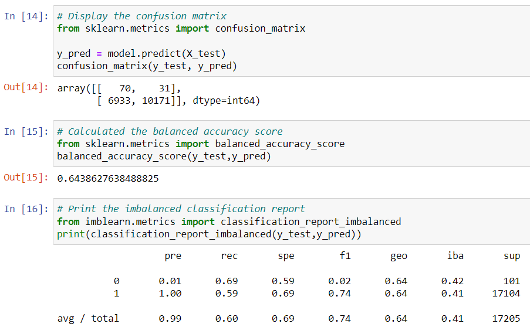
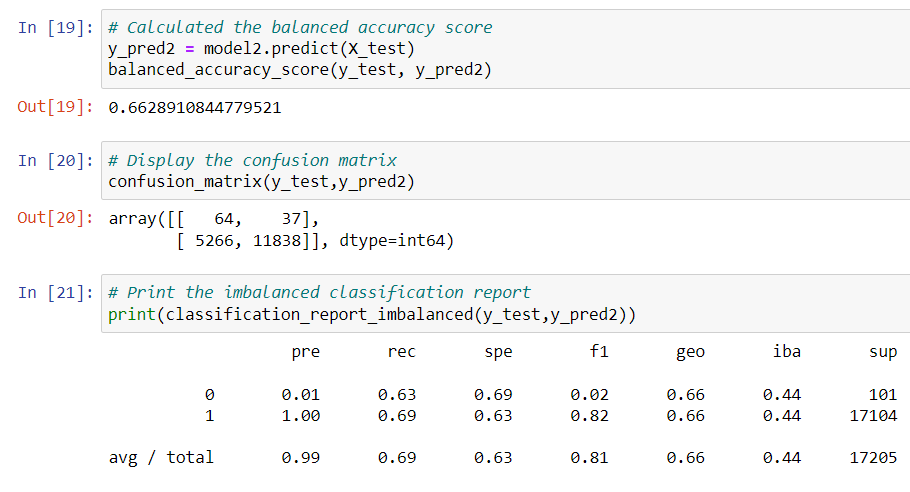
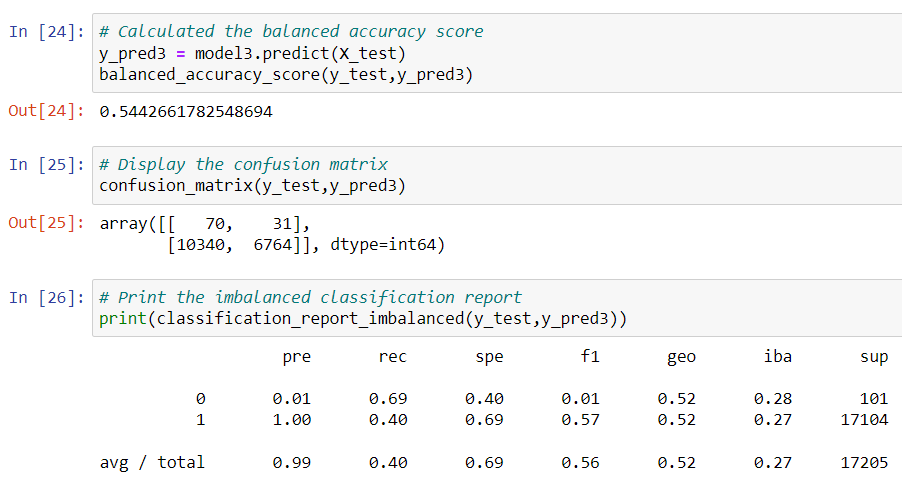
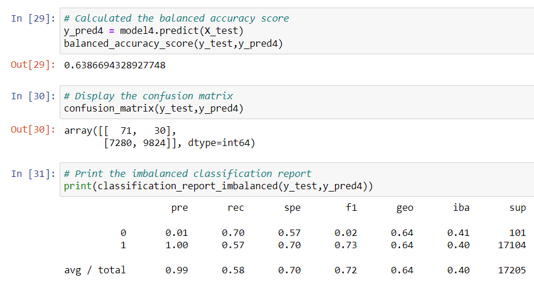
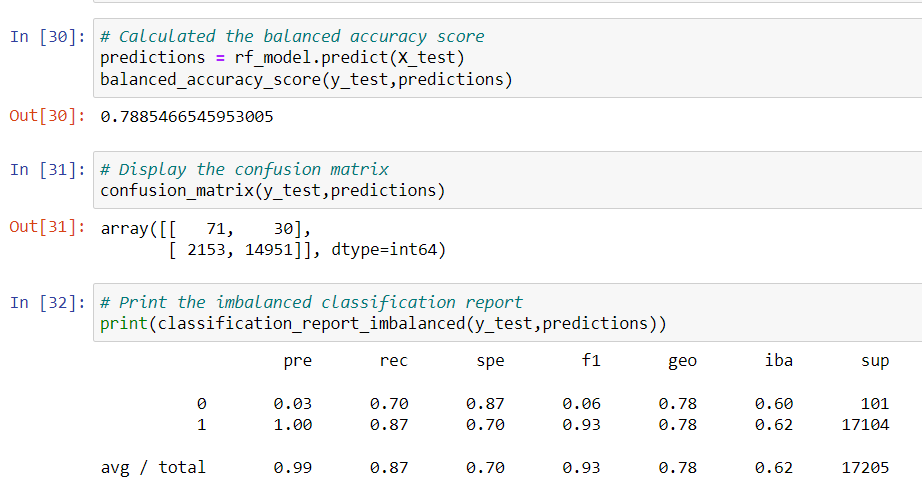
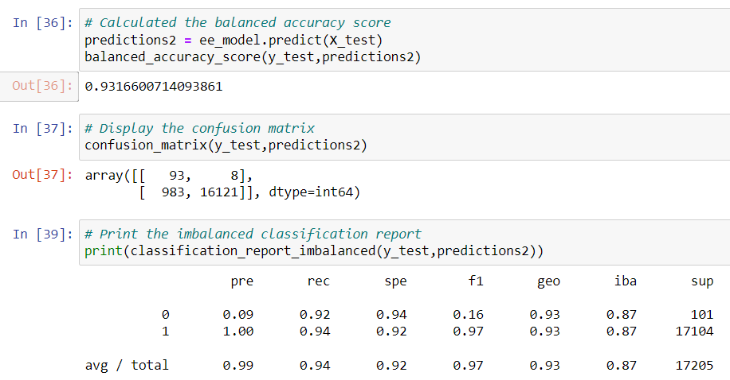

# Credit_Risk_Analysis

## Overview

We have been provided with a [credit card credit dataset](Resources/LoanStats_2019Q1.csv) from a peer-to-peer lending services company. Using this data, they would like to find a machine learning model that is able to predict credit risk. 

## Purpose

The client is evaluating models to better predict credit risk

## Results & Analysis

We have listed below, the models evaluated and their corresponding balanced accuracy, precision, and recall scores.

* RandomOverSampler

This method yielded low accuracy, recall, and F1 score. This is not a recommended model for this analysis.

* SMOTE

This model, gave a slightly higher F1 score, but similar accuracy and recall. Therefore, this model is not recommended either.

* ClusterCentroids

This method has an even lower accuracy, recall, and f1 score. Therefore, ClusterCentroids is not a recommended model for the purposes of this analysis.

* SMOTEENN

* BalancedRandomForestClassifier

* EasyEnsembleClassifier

## Summary

This dataset was difficult due to its high imbalance. The model is required to detect the few instances of high risk loaners in a sea of low risk loaners. 

In this situation, we want a high recall score. That is to say, minimize the amount of hits that predict low risk but are actually high risk as this would open the company to financial liabilities.

Reviewing the accuracy, recall and f1 scores of each model, the data seems to suggest that the ensemble classifiers (BalancedRandomForestClassifier and EasyEnsembleClassifier) performed better than the oversampling, undersampling, and SMOTEENN methods. However, caution should be applied when using these ensemble methods as they have a tendency to overfit and would thus not be applicable to real datasets.

